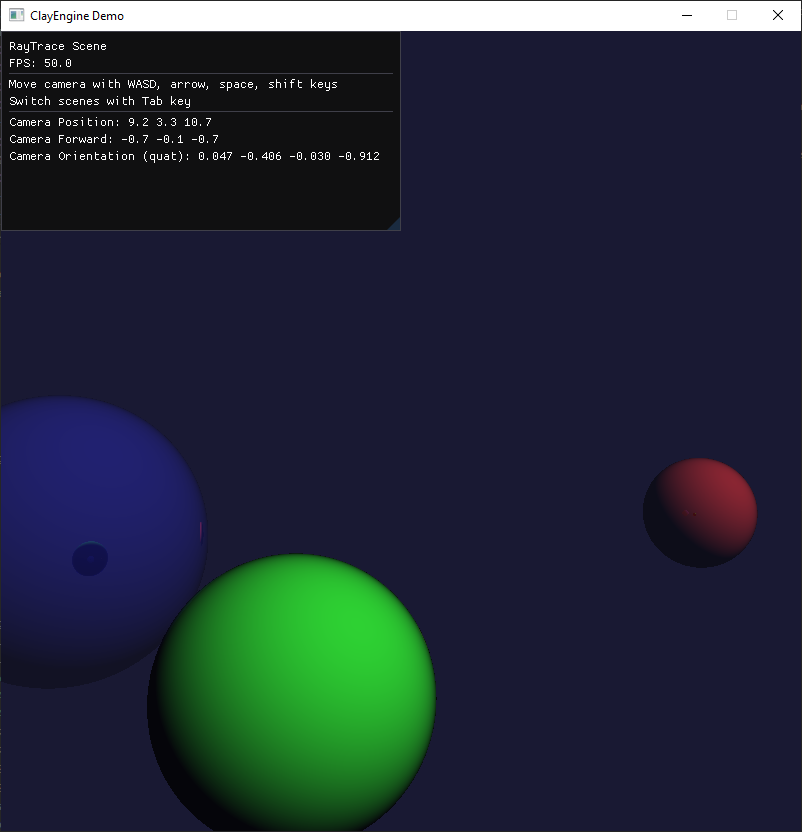

Introduction to ray tracing with OpenGL with Compute Shaders

# Instructions
- To build (outputs to `/build` directory):
    - `git submodule update --init --recursive`
    - `cmake -S . -B build`
    - `cmake --build ./build/`
- To run:
    - `./build/Debug/OpenGLTutorial.exe`

